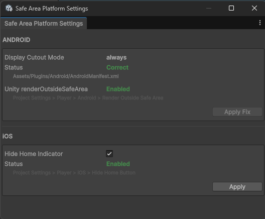

# KidzDev Unity Safe Area

Two complementary notch / safe-area components for Unity uGUI:

| Component | What it does |
| --- | --- |
| `SafeArea` | **Shrinks** a `RectTransform` inward so content stays inside the device safe area. |
| `SafeAreaOutsideMask` | **Fills** the region *outside* the safe area with colour bars so content never bleeds into the cutouts. |

Both share one change-tracking core and an in-editor device **simulator**, so you
can preview notch layouts in the Game view without deploying to a phone.

## Install

Add via Package Manager → *Add package from git URL*, or edit
`Packages/manifest.json`:

```
https://github.com/knabsiraphop/kidzdev-unity-safe-area.git#v1.1.0
```

---

## Which component do I need?

- Use **`SafeArea`** on a content panel that must not be covered by the notch or
  home bar (buttons, HUD, headers). It moves the panel's anchors inward.
- Use **`SafeAreaOutsideMask`** when you have a full-bleed background (gameplay,
  video, a photo) and want solid bars drawn over the cutout zones instead of
  shrinking the content. It paints; it does not move your content.
- They compose: a full-screen background with a `SafeAreaOutsideMask` on top, and
  a `SafeArea` panel of UI in between.

---

## `SafeArea`

Drives the attached `RectTransform`'s `anchorMin` / `anchorMax` to match the safe
area each time it changes.

**Setup**

1. Add a `SafeArea` component (menu: *Layout → Safe Area*) to the top-level
   RectTransform of a UI panel.
2. Make sure that rect is stretched to its parent with **zero offsets** — only the
   anchors are driven, so the offsets must already be `0`.
3. If you have a full-screen background you want to keep *behind* the notch, put
   the `SafeArea` on an immediate child holding the foreground content instead, and
   leave the background full-bleed.

**Per-axis control**

`ConformX` / `ConformY` let you constrain a single axis — useful when a layout
mixes full-width and full-height background stripes. A disabled axis is left at
full screen.

```csharp
var safe = panel.GetComponent<SafeArea>();
safe.ConformX = false; // ignore left/right insets, keep top/bottom
safe.ConformY = true;  // re-applies automatically on the next poll cycle
```

**`ZeroOffsets` (robust setup)**

`SafeArea` drives anchors only, so it assumes the panel's `offsetMin`/`offsetMax`
are already `0` (step 2 above). If you can't guarantee that — e.g. the panel is
reused with leftover offsets — enable **`ZeroOffsets`** and the component will also
clear the offsets each time it applies, so the panel fills the safe area exactly:

```csharp
safe.ZeroOffsets = true; // also resets offsetMin/offsetMax to zero on apply
```

---

## `SafeAreaOutsideMask`

Spawns up to four `Image` bars (Left / Right / Bottom / Top) as children and
anchors them to cover exactly the region outside the safe area.

**Setup**

1. Add a `SafeAreaOutsideMask` (menu: *Layout → Safe Area Outside Mask*) to a
   full-screen RectTransform stretched edge-to-edge (anchors `0,0`–`1,1`,
   offsets `0`). Do **not** also add a `SafeArea` to this object.
2. Make it the top-most sibling so the bars render above the masked content.
3. Set `BarColor` (and optionally a bar sprite). Leave the sprite null for a flat
   colour fill.

**Notes**

- A disabled axis spawns no bars for it: a portrait-only mask (`ConformY` only)
  creates two images instead of four.
- Bars with no cutout on their edge have zero area and are deactivated, so they
  cost no draw call, layout, or raycast.
- `raycastTarget` (default on) lets the bars swallow touches that land on the
  cutout zones.

```csharp
var mask = root.GetComponent<SafeAreaOutsideMask>();
mask.BarColor = Color.black;
mask.ConformX = false; // only top/bottom bars (portrait)
```

---

## Sample

Import the **Demo** from the Package Manager (*Samples* tab). It contains a
full-bleed teal background, a `SafeArea` content card, and a
`SafeAreaOutsideMask`, plus a controller that cycles the device simulator. Press
**Play** and watch the card shrink and the mask bars appear as the simulated
device changes (it also auto-advances every few seconds).

---

## Editor device simulator

Both components resolve their safe area through `SafeAreaSimulator`. In the editor
you can force a device's safe area so the Game view shows the notch layout:

```csharp
using KidzDev.Unity.SafeArea;

// Flip every SafeArea / SafeAreaOutsideMask in the scene to an iPhone X layout.
SafeAreaSimulator.Sim = SimDevice.iPhoneX;

// Back to the real (full-screen-in-editor) safe area.
SafeAreaSimulator.Sim = SimDevice.None;
```

Available devices: `iPhoneX`, `iPhoneXsMax`, `Pixel3XL_LandscapeLeft`,
`Pixel3XL_LandscapeRight`. The simulation is **editor-only** — in a player build
the real `Screen.safeArea` is always used.

The resolver is also exposed as pure functions for tooling and tests:

```csharp
Rect normalized = SafeAreaSimulator.Normalized(SimDevice.iPhoneX, portrait: true);
Rect pixels     = SafeAreaSimulator.Simulated(SimDevice.iPhoneX, 1125, 2436);
```

---

## How it updates

Unity raises no "safe area changed" event, so the safe area has to be polled.
Rather than give every component its own `Update`, each `SafeAreaTracker`
registers (while enabled) with a single internal `SafeAreaDriver` that polls
**once per frame for all trackers** and calls `Apply` only when the resolved safe
area, screen size, or orientation actually changes — or when an individual tracker
has a pending apply requested (an `OnValidate` inspector edit, or a
`ConformX`/`ConformY` change). So N safe-area objects cost one poll per frame, not N.

The driver polls on `EditorApplication.update` in the editor (covering edit and
play mode — both components are `[ExecuteAlways]`) and on a single hidden pump
object in a player build. A first-frame `NaN` safe area (seen on some Samsung
devices) is detected and skipped until valid.

---

## Platform notes

The components read `Screen.safeArea`, which is the OS source of truth on both
platforms, so they handle notches, the Dynamic Island, the home indicator,
rounded corners, foldables, split-screen and rotation generically — no per-device
tables at runtime. A few platform specifics worth knowing:

### iOS

Works out of the box. iOS always renders edge-to-edge and reports correct insets
for the notch / Dynamic Island / home indicator.

### Android

`Screen.safeArea` only reports a cutout inset when your app actually draws into
the cutout region. Set **Player Settings → Resolution and Presentation → Render
outside safe area = ON** if you want content (or a `SafeAreaOutsideMask`) to reach
into the cutout. With it **off**, Android letterboxes around the cutout and
`Screen.safeArea` equals the full screen — which is also handled correctly (no
shrink, no bars), there is just nothing to mask.

### Rotation

On some devices `Screen.width`/`height` and `Screen.safeArea` update on slightly
different frames during a rotation, which can cause a one-frame transient before
the layout settles. The per-frame poll re-applies as soon as either value
changes, so it self-corrects immediately. (This affects every safe-area solution,
not just this one.)

### Correct RectTransform setup

`SafeArea` drives anchors only. Put it on a rect that is stretched to its parent
with **zero offsets**, or enable **`ZeroOffsets`** (see above) so it clears the
offsets for you. A `SafeAreaOutsideMask` must sit on a **full-screen** rect
(anchors `0,0`–`1,1`, offsets `0`) — never combine it with a `SafeArea` on the
same object (the shared base enforces this via `[DisallowMultipleComponent]`).

### Editor simulator vs. device

The `SimDevice` simulator is **editor-only** (`Application.isEditor`); a player
build always uses the real `Screen.safeArea`, so simulation can never leak into
production. The Unity **Device Simulator** window works too — its reported safe
area flows straight through.

---

## Safe Area Platform Settings (Editor window)

Open via **Tools > KidzDev > Safe Area > Platform Settings**.

A single window surfaces the two project-level settings that most affect safe-area
behaviour on device — no more hunting through Player Settings or the AndroidManifest.

### Android — Display Cutout Mode

The window reads your project's `Assets/Plugins/Android/AndroidManifest.xml` and
checks whether the launcher `<activity>` has:

```xml
android:windowLayoutInDisplayCutoutMode="always"
```

| Status | Meaning |
| --- | --- |
| **Correct** (green) | The attribute is present and set to `always`. |
| **Needs Fix** (amber) | The manifest exists but the attribute is missing or wrong. |
| **No Manifest** (grey) | No `AndroidManifest.xml` found at the expected path. |

Click **Apply Fix** to let the tool patch or create the manifest automatically.
Without `always`, Android letterboxes around the cutout and `Screen.safeArea`
equals the full screen — `SafeAreaOutsideMask` will produce no bars, which is
technically correct but probably not what you want.

The window also shows the Unity **Render Outside Safe Area** player setting
(`Project Settings > Player > Android > Render outside safe area`). That toggle
must be **on** if you want content (or a `SafeAreaOutsideMask`) to actually reach
into the cutout region.

### iOS — Hide Home Indicator

The window exposes a **Hide Home Indicator** toggle that writes directly to
`PlayerSettings.iOS.hideHomeButton`. When enabled, iOS hides the home bar after a
short idle period, which maximises the visible screen area — especially useful for
games using `SafeArea` to keep UI clear of the indicator.

---

## Platform Settings window

A small editor window checks — and one-click fixes — the project settings the
runtime relies on (see **Platform notes** above). Open it from
**Tools → KidzDev → Safe Area → Platform Settings**.



- **Android — Display Cutout Mode** reads `windowLayoutInDisplayCutoutMode` from
  `Assets/Plugins/Android/AndroidManifest.xml`. **Apply Fix** sets it to `always`
  (creating a minimal manifest if none exists).
- **Android — Unity renderOutsideSafeArea** shows whether *Project Settings →
  Player → Android → Render Outside Safe Area* is enabled.
- **iOS — Hide Home Indicator** toggles `PlayerSettings.iOS.hideHomeButton`
  (*Player → iOS → Hide Home Button*); **Apply** saves it.

---

## License

MIT — see [LICENSE.md](LICENSE.md).
